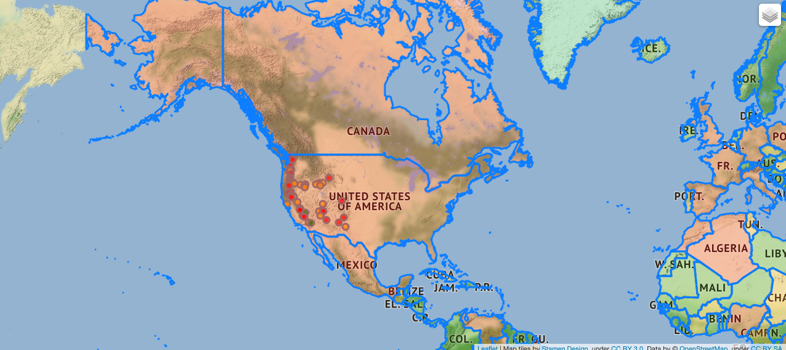
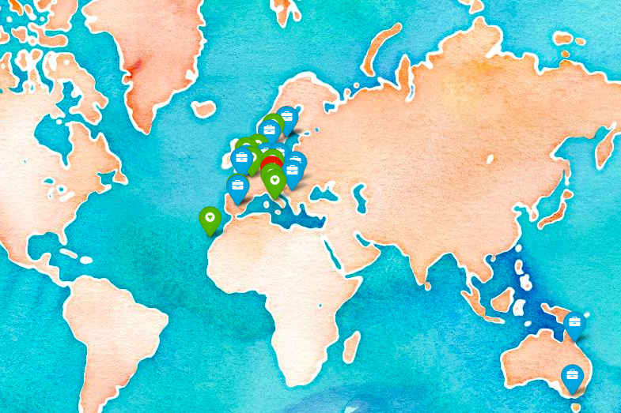

# WebMap_python

**example** : contains an example of a webmap create during the course The Python Mega Course. It is a map 2 layers were created: the first contains the markers for the vulcanos in USA and with a popup shows their altitude and a link to google search, the second assigna different colors for each country based to its population.

**my_map** : contains the file for a map with 3 different levels:
1. markers (house) for the home location with popups with a link to google images for the location
2. markers (heart) for the private life (life layer) with a popup with a link to google images for the pictures of the place
3. markers (briefcase) for work related travels (work layer) with popups with a link to the correspondent activity

